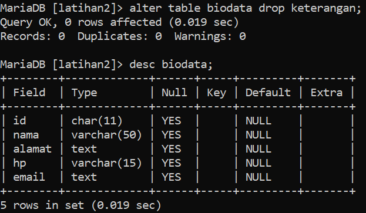
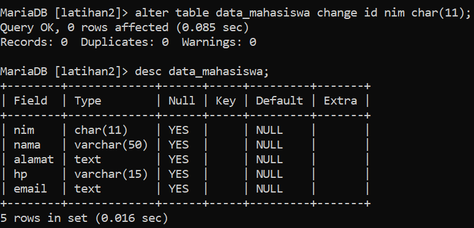

# **A. Tugas Praktikum**
1. Buat sebuah database dengan nama latihan2

2. Buat sebuah tabel dengan nama biodata (nama, alamat) didalam database latihan1!
3. Tambahkan sebuah kolom keterangan (varchar 15), sebagai kolom terakhir

4. Tambahkan kolom id int 11) di awal sebagai kolom pertama

5. Sisipkan sebuah kolom dengan nama phone (varchar 15) setelah
kolom alamat

6. Ubah tipe data kolom id menjadi char(11)!

7. Ubah nama kolom phone menjadi hp (varchar 20)

8. Tambahkan kolom email setelah kolom hp

9. Hapus kolom keterangan dari tabel

10. Ganti nama tabel menjadi data_mahasiswa

11. Ganti nama field id menjadi nim

12. Jadikan nim sebagai PRIMARY KEY

13. Jadikan kolom email sebagai UNIQUE KEY

# **B. Evaluasi dan Pertanyaan**
### 1. apa maksud int(11) ?
Di MySQL, tipe data INTEGER dengan spesifikasi (11) menunjukkan bahwa kolom tersebut menyimpan nilai numerik bulat (integer) dengan panjang maksimum 11 digit. Panjang maksimum ini mencakup digit yang digunakan untuk menunjukkan tanda negatif (-) atau positif (+).

Namun, sebenarnya spesifikasi panjang pada tipe data INTEGER di MySQL hanya merupakan layanan metadata semata. Artinya, nilai yang disimpan di dalam kolom integer tidak terbatas jumlah digitnya walaupun kita menentukan spesifikasi (11) pada kolom tersebut.

Dalam prakteknya, panjang maksimum kolom integer yang dapat ditampung bergantung pada jenis tipe data integer yang dipilih, seperti TINYINT, SMALLINT, MEDIUMINT, dan BIGINT. Semakin besar jenis tipe data integer yang dipilih, semakin banyak pula jumlah digit yang dapat ditampung oleh kolom tersebut.
### 2. Ketika kita melihat struktur tabel dengan perintah desc, ada kolom Null yang berisi Yes dan No. Apa maksudnya ?
Pada MySQL, kolom Null menunjukkan apakah sebuah kolom diperbolehkan untuk memiliki nilai null (kosong) atau tidak. Ketika kita mendefinisikan sebuah tabel, kita dapat menentukan apakah kolom tertentu harus mengandung nilai unik atau tidak boleh kosong.

Jika kolom memperbolehkan Null, maka kita dapat memasukkan nilai kosong ke dalam kolom tersebut, jika kita ingin. Pada tampilan kolom Null, nilai "No" menunjukkan bahwa kolom tidak memperbolehkan nilai kosong dan kita harus memasukkan nilai yang valid ke dalam kolom tersebut. Sedangkan nilai "Yes" menunjukkan bahwa kolom memperbolehkan nilai kosong dan kita dapat memasukkan nilai kosong ke dalam kolom tersebut jika kita mau.

Penting untuk memahami apakah sebuah kolom diperbolehkan Null atau tidak, karena hal ini akan mempengaruhi cara kita menyimpan dan mengambil data pada database. Jika sebuah kolom tidak diperbolehkan Null, maka kita harus memastikan kita selalu memasukkan nilai yang valid ke dalam kolom tersebut ketika kita melakukan operasi INSERT atau UPDATE.