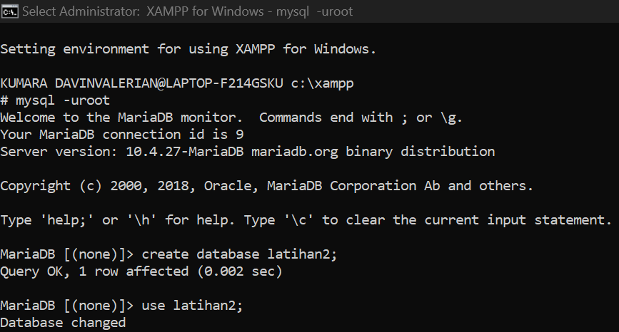
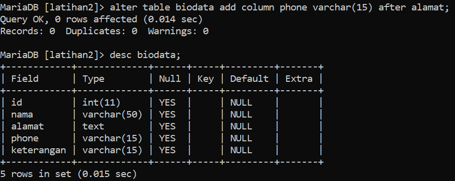
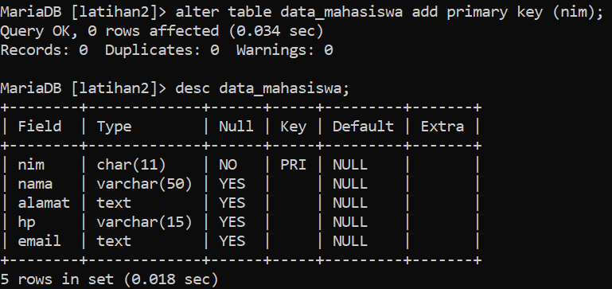

# **A. Tugas Praktikum**
1. Buat sebuah database dengan nama latihan2

2. Buat sebuah tabel dengan nama biodata (nama, alamat) didalam database latihan1!
3. Tambahkan sebuah kolom keterangan (varchar 15), sebagai kolom terakhir

4. Tambahkan kolom id int 11) di awal sebagai kolom pertama

5. Sisipkan sebuah kolom dengan nama phone (varchar 15) setelah
kolom alamat

6. Ubah tipe data kolom id menjadi char(11)!

7. Ubah nama kolom phone menjadi hp (varchar 20)

8. Tambahkan kolom email setelah kolom hp

9. Hapus kolom keterangan dari tabel

10. Ganti nama tabel menjadi data_mahasiswa

11. Ganti nama field id menjadi nim

12. Jadikan nim sebagai PRIMARY KEY

13. Jadikan kolom email sebagai UNIQUE KEY

# **B. Evaluasi dan Pertanyaan**
1. apa maksud int(11) ?
2. Ketika kita melihat struktur tabel dengan perintah desc, ada kolom Null yang
berisi Yes dan No. Apa maksudnya ?
